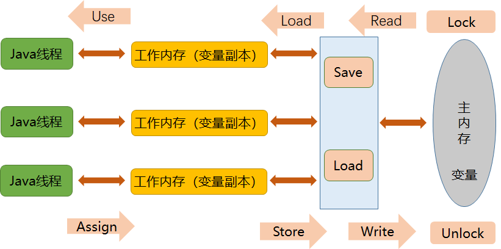
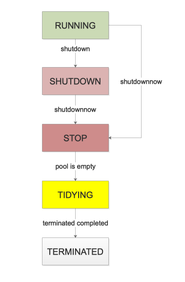

# 多线程高并发梳理

## 基础知识

### 1、进程 线程 纤程概念

- 进程

  > 进程是一个应用在操作系统中正在运行的状态。也是操作系统资源分配的基本单位。

- 线程

  > 线程是一个进程执行逻辑的基本单位。也是操作系统进行调度的基本单位。

- 纤程

  > 纤程是线程的线程。线程需要经过操作系统内核态进行调度，而纤程不需要经过内核态，仅在用户态调度。一般一个操作系统下1万个线程就已经卡的不行，而纤程可以发起10万+个。

### 2、线程的6个状态

- NEW

  > new Thread()

- RUNNABLE

  > - RUNNING
  >
  >   当前线程正在被操作系统调度执行。
  >
  > - READY
  >
  >   当前线程在monitor队列中等待cpu资源，等待被调度执行。

- WAITING

  > 线程被无限等待地挂起
  >
  > - object.wait()
  > - lockSupport.park()
  > - thread.join()

- TIME WAITING

  > 线程被被带超时时间地挂起
  >
  > - thread.sleep(time)
  > - thread.join(time)
  > - object.wait(time)
  > - lockSupport.parknano(time)
  > - lockSupport.parkuntil(time)

- TERMINATE

  > 线程完成

- BLOCK

  > 线程2执行到带锁的代码块时（此时锁资源被线程1占有），线程2状态BLOCK

### 3、sleep, yield, join原理

- sleep

  > 让当前线程睡眠，但不会释放持有的锁资源。

- yield

  > 当前线程给调度器一个hint，让出cpu。

- join

  > 当线程1代码上，执行线程2.join()，则线程1被挂起，阻塞等待直到线程2执行完成，才继续执行线程1。

### 4、synchronized原理

#### 4.1、为什么要用synchronized？

> 多线程抢占资源时，针对每个线程，需求要有序且独占地执行代码块，此时需要用到synchronized关键字。

#### 4.2、优化

> jdk1.5以前（含1.5）synchronized直接是重量级锁。每次获取独占锁资源，都需要在用户态、内核态之间切换，增加系统资源开销。
>
> jdk1.6开始，优化synchronized，引入了锁升级：偏向锁、轻量级锁（自旋锁）、重量级锁。synchronized性能提高。

#### 4.3、重量级锁原理

> - java支持monitor机制
>
>   - monitor机制在内核态执行，应用程序在用户态，因此需要切换。
>
>   - 任何一个java对象都可以作为锁，且都有一个monitor对象与之关联。
>
> - monitor概念
>
>   - 管程。是一个同步工具。操作系统中，存在semaphore和mutex，信号量和互斥锁。monitor是在mutex和semaphore基础上更高层次的同步原语。
>
>   - 在同一时间，只有一个线程/进程能进入monitor定义的临界区（达到互斥的效果），无法进入临界区的线程/进程应该被阻塞，并且在适当的时候被唤醒。
>
> - monitor基本元素
>
>   - 临界区
>
>     > 被synchronized关键字修饰的代码块。
>
>   - monitor对象和锁
>
>     > synchronized(this)的this
>
>   - 条件变量以及定义在monitor对象上的wait，signal操作
>
>     > object.wait(), object.notify()
>
> - monitor原理
>
>   - waiting queue
>
>     > 等待队列。
>     >
>     > - contention list 
>     >
>     >   竞争队列。请求锁资源的线程，先进竞争队列。
>     >
>     > - entry list
>     >
>     >   有资格成为候选人的线程，被放到entry list。
>
>   - on deck
>
>     > 任何时刻最多只能一个线程正在竞争锁，该线程叫onDeck。
>
>   - owner
>
>     > 获得锁资源的线程。
>
>   - blocking queue
>
>     > - wait set
>     >
>     >   那些调用wait方法被阻塞的线程，被放到wait set。直到被唤醒后，被放到entry list。

#### 4.4、锁升级原理

- java对象实例

  > - 对象头
  > - 实例数据
  > - 对齐填充

- 对象头

  > **存储内容：**
  >
  > - mark world
  >
  >   *锁标志位-3位（001无锁、101偏向锁、00轻量级锁、10重量级锁）*
  >
  >   - 无锁：对象的hashcode + 锁标志位（0 01）
  >   - 偏向锁：（线程A抢占到锁），线程A id + 锁标志位（1 01）
  >   - 轻量级锁：（线程A抢占到锁，线程B请求锁资源，自旋），栈中锁记录指针 + 标志位（00）
  >   - 重量级锁：（轻量级锁的基础上，超过自旋次数阈值），重量级锁的指针 + 标志位（10）
  >
  > - 指向类的指针
  >
  > - 数组长度

- 锁升级流程

  - 无锁：没有线程占有当前锁资源；此时对象头mark word标记（对象hashcode + 0 01）
  - 升级偏向锁：线程A申请并占有锁资源，此时对象头mark work标记（线程A id + 1 01）
  - 保持偏向锁：线程A正占有锁资源，此时线程B申请锁资源，发现对象头为偏向锁于线程A。线程B自旋等待，自旋后再次申请，此时若申请成功，则锁资源对象头mark word标记变更为（线程B id + 1 01）
  - 升级轻量级锁：若线程B自旋仍申请失败，升级轻量级锁，
    - 此时jvm会在**线程B的线程栈中开辟一块独立空间（LockRecord）**。
    - 拷贝当前锁对象中mark word内容到LockRecord。
    - CAS操作尝试将锁对象mark word内容更新为指向LockRecord指针。
    - 若CAS成功，在锁对象mark word标记（指向这片LockRecord空间的指针 + 00）
  - 升级重量级锁：若CAS次数达到阈值次数，仍未成功。此时会膨胀到重量级锁。锁对象mark word标记（指向重量级锁的指针 + 10）

### 5、JMM原理

#### 5.1、现代计算机内存模型

> - cpu指令运算速度，远超主内存存取速度。
> - 处理器的运算速度与存储设备速度有几个数量级的差距。
> - 而一个复杂的运算任务往往需要处理器与内存交互。
> - 为了在cpu与内存发生I/O时，不浪费cpu的等待时间，现代计算机系统引入了读写速度尽可能接近处理器运算速度的高速缓存，作为cpu与内存间的缓冲。

##### 5.1.1、如何保证缓存一致性

> - 现象：
>   - 缓存特性：每核cpu都有自己的高速缓存，缓存共享同一块主内存。
>   - 当多个cpu的运算任务，都涉及同一块主存区域时，可能出现各自的缓存不一致。
>
> - 解决：**缓存一致性协议：要求各个处理器访问缓存时，都要遵循一些协议，在读写时根据协议进行操作。**
>
>   *协议有：MSI、MESI、MOSI等*
>
>   如MESI协议，根据**缓存行（cache line）**状态，判断高速缓存中的 cache line 是否有效。

##### 5.1.2、合并写技术

> - 每个处理器有自己独享的写缓冲区。
>
> - cpu发生写操作时，先写到缓冲区，再由缓冲区合并写技术，批量写到主内存中。保证cpu高效不停止。
>
> **问题：写缓冲区批量刷新到主存时，可能存在指令重排。**

#### 5.2、JMM（java内存模型）

##### 5.2.1、什么是“java内存模型”？

> - *屏蔽各种硬件和操作系统的内存访问差异，以实现让java程序在各种平台上都能达到一直的内存访问效果。*
> - *定义程序中各个变量的访问规则，即在虚拟机中将变量存储到内存，和从内存中取出变量这样的底层实现。*

##### 5.2.2、jmm内存划分

> - jmm定义了线程和主内存之间的抽象关系。
>   - 线程间共享的变量存储在**主内存**。
>   - 每个线程都有一个私有的**工作内存**。

##### 5.2.3、变量的读写操作原理

> - 内存交互操作指令
>
>   | 指令           | 描述                                                         |
>   | -------------- | ------------------------------------------------------------ |
>   | lock（锁定）   | 作用于主内存变量，把一个变量标识为线程独占状态。             |
>   | unlock（解锁） | 作用于主内存变量，把一个处于锁定状态的变量释放，释放后的变量才可以被其他线程锁定。 |
>   | read（读取）   | 作用于主内存变量，把一个变量的值从**主内存**传输到线程的**工作内存**中，以便随后的load操作使用。 |
>   | load（载入）   | 作用于工作内存变量，把read操作取出来的变量放入**工作内存**的变量副本中。 |
>   | use（使用）    | 作用于工作内存变量，把**工作内存中**的变量传输给**执行引擎**，每当虚拟机遇到一个需要使用到变量的值，就会使用这个指令。 |
>   | assign（赋值） | 作用于工作内存变量，把一个**执行引擎**中接收到的值放入**工作内存**的变量副本中。 |
>   | store（存储）  | 作用于主内存变量，把一个从**工作内存**中变量的值传送到**主内存**，一遍后续write使用。 |
>   | write（写入）  | 作用于主内存变量，把store操作后变量的值放入**主内存**的变量中。 |
>
>   
>
> - 指令的使用规则
>
>   - 必须组合使用：read和load，store和write。
>   - **工作内存**中的变量发生改变，必须告知**主内存**。
>   - **工作内存**中的变量没有发生改变，不能同步回**主内存**。
>   - 一个新的变量必须在**主内存**诞生，不允许**工作内存**直接使用一个未初始化的变量。
>   - 一个变量同一时间只有一个线程执行lock，多次lock必须有相同次数的unlock。
>   - 若对一个变量进行lock操作，会清空**所有工作内存**中该变量的值。在执行引擎使用这个变量前，必须重新load或assign操作初始化变量的值。
>   - 若一个变量没有被lock，则不能对其unlock。也不能unlock一个被其他线程锁住的变量。
>   - 对一个变量进行unlock前，必须把此变量同步回**主内存**。
>
> - 关键字
>
>   - volatile
>
>     > volatile要求被修改之后的变量，立即更新到主内存，每次使用前从主内存处进行读取。
>
>   - synchronized
>
>     > synchronized保证unlock之前必须先把变量刷新回主内存。
>
>   - final
>
>     > final修饰的字段在构造器中一旦完成初始化，并且构造器没有this逸出，那么其他线程就能看到final字段的值。

##### 5.2.3、happen-before原则

> 当A操作发生在B操作之前，在B操作时，A操作产生的影响（修改内存中共享变量的值、发送了消息、调用的方法等）B能感知到。
>
> - **作用**
>   - 单线程环境下，指令重排优化，基于HB的约束。
>   - 多线程环境下，HB的约束，保证线程数据一致性。（需要自己在代码上声明和保证）
>
> - 8大原则：
>   - 程序次序规则（Program Order Rule）：在一个线程内，程序的执行规则跟程序的书写规则是一致的，从上往下执行。
>   - 管程锁定规则（Monitor Lock Rule）：一个Unlock的操作肯定先于下一次Lock的操作。这里必须是同一个锁。同理我们可以认为在synchronized同步同一个锁的时候，锁内先行执行的代码，对后续同步该锁的线程来说是完全可见的。
>   - volatile变量规则（volatile Variable Rule）：对同一个volatile的变量，先行发生的写操作，肯定早于后续发生的读操作。
>   - 线程启动规则（Thread Start Rule）：Thread对象的start()方法先行发生于此线程的每一个动作。
>   - 线程中止规则（Thread Termination Rule）：Thread对象的中止检测（如：Thread.join()，Thread.isAlive()等）操作，必行晚于线程中所有操作。
>   - 线程中断规则（Thread Interruption Rule）：对线程的interruption（）调用，先于被调用的线程检测中断事件(Thread.interrupted())的发生。
>   - 对象中止规则（Finalizer Rule）：一个对象的初始化方法先于一个方法执行Finalizer()方法。
>   - 传递性（Transitivity）：如果操作A先于操作B、操作B先于操作C,则操作A先于操作C。

### 6、volatile原理

#### 6.1、为什么要用volatile?

> volatile的两大特性（遵循happen before的volatile原则）
>
> - 保证线程可见性
> - 防止指令重排序

#### 6.2、volatile如何实现两大特性？

> - 线程可见性
>
>   由jmm的读写规则保证：volatile修饰的变量，每次更新后立即同步到主内存，每次读操作都从主内存中获取。
>
> - 防止指令重排
>
>   由cpu指令“内存屏障”保证。
>
>   - 内存屏障
>
>     是一个cpu指令。（1）保证特定操作的顺序。（2）保证变量的内存可见性。

### 7、AQS原理

#### 7.1、什么是AQS

> abstractQueueSynchronizer，抽象队列同步器。是其他同步组件的基础框架：*ReentrantLock, ReentrantReadWriteLock, Semaphore, CountDownLatch*等。

#### 7.2、AQS的原理与流程

> 维护了一个state变量和node双向fifo链表。
>
> - **获取资源**，原理与流程
>   - acquire(1)请求资源许可，acquire会调用一次tryAcquire(1)尝试获取资源。
>   - 若获取成功，则state加1，并调用AQS父类AbstractOwnableSynchronizer设置独占线程，把当前线程设置为独占线程。
>   - 若获取失败，则说明前面已经有线程占用这个资源，需要等待直到线程释放。此时，AQS把当前线程封装成node节点，放入node双向链表，随后LockSupport.park()阻塞当前线程。**此时node节点的waitStatus为signal。**
>   - 假如这个线程阻塞后，被唤醒，则继续循环调用tryAcquire方法获取资源许可。若获取失败，则阻塞等待被唤醒。
>   - 若获取成功，则把自身node节点设置为node链表的头节点，把之前的头节点去掉。
> - **释放资源**，原理与流程
>   - release(1)释放资源许可，release会调用tryRelease(1)方法尝试释放资源。
>   - 若释放成功，则state减1，再调用AQS父类AbstractOwnableSynchronizer设置独占线程，设置为null。然后唤醒当前节点的下一任node节点线程，LockSupport.unpark(next)。
> - **condition单向链表**
>   - **描述**
>     - Condition是一个接口，AQS的内部类ConditionObject实现了这个接口。接口含await、signal方法，类似Object类的wait、notify方法。
>     - Condition的阻塞和唤醒，由LockSupport.park(), LockSupport.unpark(thread)来实现，并提供了超时机制。
>     - Conditon不由AQS维护，当需要await和signal机制，通过new ConditionObject()生成这个对象，调用这个对象的方法即可。
>     - AQS本身不存在这个对象的引用，condition单向链表也是ConditionObject类本身在维护。
>   - **Condition.await()，**阻塞等待
>     - 当前线程进入等待状态。ConditionObject将当前线程包装成node节点，若condition单向链表的尾节点null，则同时放到头节点（firstwaiter）和尾结点（lastwaiter）。否则同时放入下一个节点（nextwaiter）和尾节点（lastwaiter）。随后将自身阻塞。**此时node节点的waitStatus为condition。**
>   - **Condition.signal()，**唤醒
>     - 唤醒condition单向链表的头节点线程。ConditionObject将condition单向链表头节点，入队AQS双向链表（插入到尾结点），阻塞等待走AQS双向链表唤醒流程。**此时node节点的waitStatus为signal。**
> - **公平锁与非公平锁**
>   - 公平锁，不插队。先判断队列中有无node节点排队。
>   - 非公平锁，可插队。进队前先cas尝试抢占资源，失败了再排队。

#### 7.3、CLH锁原理

> AQS使用到了CLH队列的变种。
>
> - 背景
>
>   CLH锁名字与之发明人名字有关：Craig，Landin and Hagersten。
>
> - 原理
>
>   CLH是自旋锁的一种，也是一种基于单向链表的高性能、公平自旋锁，申请加锁的线程只需要在其前驱节点的本地变量上自旋，判断锁是否已释放。从而极大减少了不必要的处理器缓存同步的次数，降低了总线和内存的开销。
>
> - 缺点
>
>   线程多的时候，消耗cpu资源。仅适用于短平快的场景下。

### 8、ThreadLocal原理

>  ThreadLocal是并发场景下用来解决变量共享问题的类。**它使原本线程间共享的对象进行线程隔离**，即一个对象只对一个线程可见。

#### 8.1、ThreadLocal原理

> - **概括**
>   - 1个Thread有且仅有1个ThreadLocalMap对象
>   - 1个Entry对象的key弱引用指向1个ThreadLocal对象
>   - 1个ThreadLocalMap对象存储多个Entry对象
>   - 1个ThreadLocal对象可以被多个线程共享
>   - ThreadLocal对象不持有Value，Value由线程的Entry对象持有
> - **核心方法**
>   - set(T value)、get()、remove()，均交由ThreadLocalMap来管理。

#### 8.2、ThreadLocalMap原理

> - ThreadLocalMap 是 Thread 的私有成员变量 threadLocals；
>
> - Entry[]数组
>
>   - **计算数组下标值**
>
>     - ThreadLocal 实例变量`threadLocalHashCode`。每当创建ThreadLocal实例时这个值都会累加 `0x61c88647`, 目的：**为了让哈希码能均匀的分布在2的N次方的数组里, 即** Entry[]
>     - 开放地址法 计算数组下标：threadLocalHashCode & (len-1)
>
>     ```java
>     /**
>              * Set the value associated with key.
>              *
>              * @param key the thread local object
>              * @param value the value to be set
>              */
>             private void set(ThreadLocal<?> key, Object value) {
>     
>                 // We don't use a fast path as with get() because it is at
>                 // least as common to use set() to create new entries as
>                 // it is to replace existing ones, in which case, a fast
>                 // path would fail more often than not.
>     
>                 Entry[] tab = table;
>                 int len = tab.length;
>                 int i = key.threadLocalHashCode & (len-1);
>     
>                 for (Entry e = tab[i];
>                      e != null;
>                      e = tab[i = nextIndex(i, len)]) {
>                     ThreadLocal<?> k = e.get();
>     
>                     if (k == key) {
>                         e.value = value;
>                         return;
>                     }
>     
>                     if (k == null) {
>                         replaceStaleEntry(key, value, i);
>                         return;
>                     }
>                 }
>     
>                 tab[i] = new Entry(key, value);
>                 int sz = ++size;
>                 if (!cleanSomeSlots(i, sz) && sz >= threshold)
>                     rehash();
>             }
>     
>     ```
>
>   - **进组操作**（ThreadLocalMap.set()方法）
>
>     - 计算数组下标。
>     - 进组。把ThreadLocal对象以及它的值，包装到Entry对象，并放进数组的指定下标里；
>
>   - **查询操作**（ThreadLocalMap.get()方法）
>
>     - 计算数组下标。
>     - 查询。根据下标值找到Entry对象，并确认Entry引用对象（key）==当前ThreadLocal实例。
>
>   - **数组扩容 resize()**
>
>     - 当entry对象数量达到阈值，触发扩容；
>     - 新数组长度扩大2倍；
>     - 遍历老数组所有entry对象，重新计算下标值，并放进新Entry数组；

#### 8.3、使用场景

> - 在进行对象跨层传递时，ThreadLocal能避免多次传递，打破层次间约束；
> - 线程间数据隔离；
> - 事务操作，用于存储事务信息；
> - 数据库连接，session会话管理；

#### 8.4、关于内存泄露

> - Thread类含ThreadLocalMap字段threadLocals，ThreadLocalMap由Entry数组组成，Entry类的key弱引用ThreadLocal对象，value为Object类型。
> - 在thread生命周期内，threadlocals伴随存在。而ThreadLocal对象可能会被业务代码设置null，此时若发生gc，Entry对象弱引用的key对象被回收。但value因还被Entry持有，value的内存不会被释放。出现内存泄露。

### 9、线程池

#### 9.1、为什么要用线程池？

> 在大量创建线程执行任务的场景下，如果每次都如此的 创建线程——》执行任务——》销毁线程，会造成很大的性能开销。因此有了线程池池化的思想，调度线程池中的线程来复用执行每一项任务。

#### 9.2、线程池构造函数7大参数

> - corePoolSize：核心线程数，常驻线程数。
> - maximumPoolSize：最大线程数，当线程池核心线程都在执行任务，且等待队列已满，此时增加线程池线程数，直到达到该阈值。
> - keepAliveTime：非核心线程空闲时间。
> - timeUnit：空闲时间单位。
> - workQueue：多余任务等待队列。
> - threadFactory：创建线程工厂，统一创建线程的属性。
> - handler：线程池拒绝策略，已达最大线程数，且任务队列已满时，线程池的拒绝策略。

#### 9.3、核心内容

> - ThreadPoolExecutor成员变量 `ctl`
>
>   高三位表示线程池的状态，低29位表示线程池中现有的线程数
>
>   ```java
>   //CAS，无锁并发
>       private final AtomicInteger ctl = new AtomicInteger(ctlOf(RUNNING, 0));
>       //表示线程池线程数的bit数
>       private static final int COUNT_BITS = Integer.SIZE - 3;
>       //最大的线程数量，数量是完全够用了
>       private static final int CAPACITY   = (1 << COUNT_BITS) - 1;
>   
>       // runState is stored in the high-order bits
>       //1110 0000 0000 0000 0000 0000 0000 0000（很耿直的我）
>       private static final int RUNNING    = -1 << COUNT_BITS;
>       //0000 0000 0000 0000 0000 0000 0000 0000（很耿直的我）
>       private static final int SHUTDOWN   =  0 << COUNT_BITS;
>       //0010 0000 0000 0000 0000 0000 0000 0000（很耿直的我）
>       private static final int STOP       =  1 << COUNT_BITS;
>       //0100 0000 0000 0000 0000 0000 0000 0000（很耿直的我）
>       private static final int TIDYING    =  2 << COUNT_BITS;
>       //0110 0000 0000 0000 0000 0000 0000 0000（很耿直的我）
>       private static final int TERMINATED =  3 << COUNT_BITS;
>   
>       // Packing and unpacking ctl
>       //获取线程池的状态
>       private static int runStateOf(int c)     { return c & ~CAPACITY; }
>       //获取线程的数量
>       private static int workerCountOf(int c)  { return c & CAPACITY; }
>       //组装状态和数量，成为ctl
>       private static int ctlOf(int rs, int wc) { return rs | wc; }
>   
>       /*
>        * Bit field accessors that don't require unpacking ctl.
>        * These depend on the bit layout and on workerCount being never negative.
>        * 判断状态c是否比s小，下面会给出状态流转图
>        */
>       
>       private static boolean runStateLessThan(int c, int s) {
>           return c < s;
>       }
>       
>       //判断状态c是否不小于状态s
>       private static boolean runStateAtLeast(int c, int s) {
>           return c >= s;
>       }
>       //判断线程是否在运行
>       private static boolean isRunning(int c) {
>           return c < SHUTDOWN;
>       }
>   ```
>
>   **线程池的状态，5种：**
>
>   - RUNNING，运行状态，刚创建线程池。
>   - SHUTDOWN，停止工作，不再接收新任务，已经接收的会继续执行。
>   - STOP，停止状态，不再接收新任务，已经接收正在执行的，会中断。
>   - TIDYING，清空状态，所有任务都停止了，工作线程也全部结束。
>   - TERMINATED，终止状态，线程池已销毁。
>
>   
>
> - execute方法
>
>   - 线程池优先分配任务给核心线程，来一个new一个，直到核心线程数满；
>   - 核心线程数已满，任务扔进阻塞队列；
>   - 队列已满，则创建非核心线程处理；
>   - 非核心线程数已满，则线程池走拒绝策略；
>
>   ```java
>      public void execute(Runnable command) {
>           if (command == null)
>               throw new NullPointerException();
>           //第一步，获取ctl
>           int c = ctl.get();
>           //检查当前线程数是否达到核心线程数的限制，注意线程本身是不区分核心还是非核心，后面会进一步验证
>           if (workerCountOf(c) < corePoolSize) {
>               //如果核心线程数未达到，会直接添加一个核心线程，也就是说在线程池刚启动预热阶段，
>               //提交任务后，会优先启动核心线程处理
>               if (addWorker(command, true))
>                   return;
>               //如果添加任务失败，刷新ctl，进入下一步
>               c = ctl.get();
>           }
>           //检查线程池是否是运行状态，然后将任务添加到等待队列，注意offer是不会阻塞的
>           if (isRunning(c) && workQueue.offer(command)) {
>              //任务成功添加到等待队列，再次刷新ctl
>               int recheck = ctl.get();
>              //如果线程池不是运行状态，则将刚添加的任务从队列移除并执行拒绝策略
>               if (! isRunning(recheck) && remove(command))
>                   reject(command);
>               //判断当前线程数量，如果线程数量为0，则添加一个非核心线程，并且不指定首次执行任务
>               else if (workerCountOf(recheck) == 0)
>                   addWorker(null, false);
>           }
>          //添加非核心线程，指定首次执行任务，如果添加失败，执行异常策略
>           else if (!addWorker(command, false))
>               reject(command);
>       }
>       
>       /*
>        * addWorker方法申明
>        * @param core if true use corePoolSize as bound, else
>        * maximumPoolSize. (A boolean indicator is used here rather than a
>        * value to ensure reads of fresh values after checking other pool
>        * state).
>        * @return true if successful
>        */
>       private boolean addWorker(Runnable firstTask, boolean core) {
>       //.....
>       }
>   ```
>
>   

#### 9.4、关键技术

> - 锁（lock, cas）
> - 阻塞队列
> - hashSet（资源池）

#### 9.5、问题

##### 9.5.1、线程池的线程是如何做到复用的？

> 线程池中的线程在循环中尝试取任务执行，这一步会被阻塞（blockingQueue取任务时），如果设置了allowCoreThreadTimeOut为true，则线程池的所有线程都会在keepAliveTime时间超时后，还未取到任务而退出。或者线程池已经STOP，那么所有线程都会被中断，然后退出。

##### 9.5.2、线程池是如何做到高效并发的？

> 特别关注的并发点：
>
> - 线程池状态和工作线程数量的变更。这里由一个AtomicInteger变量ctl来解决原子性问题。
> - 向工作Worker容器workers中添加新worker时。加锁。
> - 工作线程Worker从等待队列中取任务时。由工作队列本身来保证线程安全，比如LinkedBlockingQueue等。

##### 9.5.3、从线程池的设计中，我们能学到什么？

> 1、清楚实现原理，可以指导我们更好的使用。
>
> 2、在写并发程序的时候，尽可能缩小锁的范围，提高代码的吞吐率。
>
> 3、goto，不是一定不能用，而是不能滥用，有些场景有奇效。
>
> 4、如果需要多个线程安全的int型变量，考虑利用位运算把它们合并为一个。
